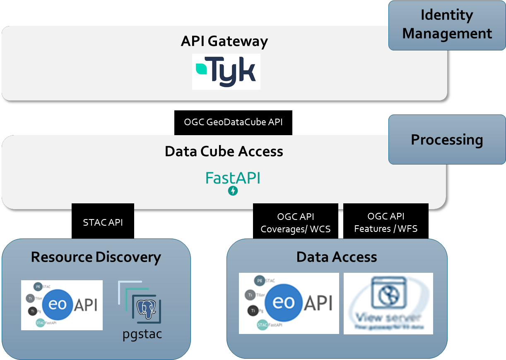

# Architecture

Datacube Access provides an API to allow the elaborate dissemination of Datacubes

* **Data Discovery / Access** 
  This set of APIs is based upon the OGC API Coverage and Features families of interfaces to provide data discovery capabilities of the stored data items.

* **Coverage Access** 
  Using the OGC API Coverages, it is possible to access the raw data of the stored scenes as a datacube (multidimensional entities)

* **Features / STAC API** 
  This API frontend is a pass through for the data stored in the resource discovery building block or other data catalogs.

* **Process Discovery / Execution** 
  The Datacube Access BB exposes endponts to discover, deploy, and execute processes. These processes can be defined as application packages or openEO process graphs.

